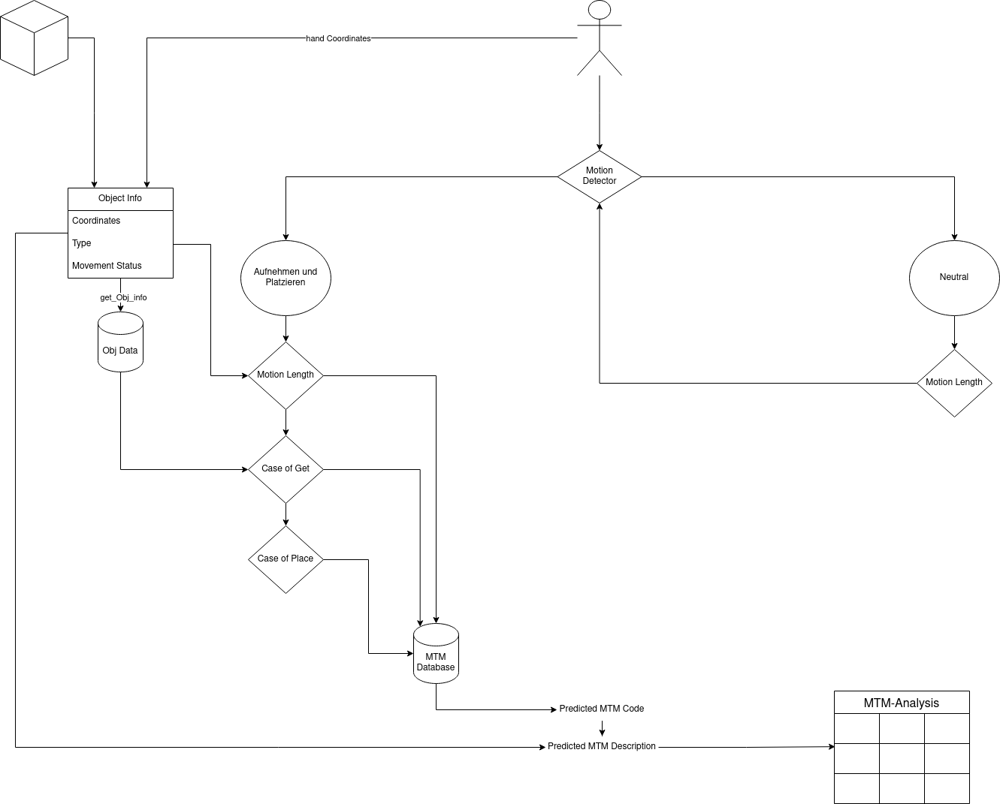
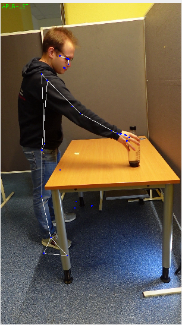
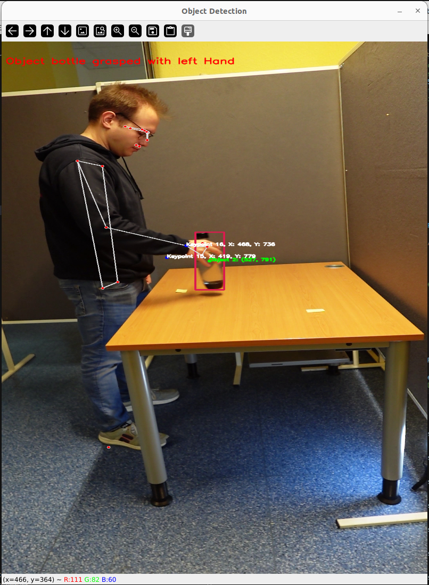

# Master-Thesis -- "Multimodale Bewegungserkennung"
---

---
## Body Movement Classification

This scripts contains scripts for classifying body movements using Mediapipe, OpenCV, and LSTM neural networks. The scripts enable the creation of a dataset from video files, training an LSTM model for movement classification, and testing the model on real-time videos.



### Make Dataset Script

The make_dataset.py script enables the creation of a dataset from video files. It utilizes Mediapipe and OpenCV to capture the body pose in each frame and extract landmarks. The extracted landmarks are then saved into CSV files for use in training the LSTM model.

### Train LSTM Script

The train_lstm.py script reads the created dataset and trains an LSTM model for body movement classification. It utilizes Keras and TensorFlow for model training and generates a confusion matrix to evaluate the model's performance.

### Test LSTM Script

The test_lstm.py script allows testing the trained LSTM model on real-time videos. It captures the body pose in each frame of the video and utilizes the trained model to classify the movement. Predictions are saved in a CSV file, and the video is displayed with the predictions.

### Requirements

- Python 3.x
- OpenCV
- Mediapipe
- Pandas
- NumPy
- Keras
- TensorFlow
- tqdm
- scikit-learn
- seaborn
- matplotlib

### Usage Guide

1. Ensure all requirements are installed.
2. Run the make_dataset.py script to create the dataset.
3. Run the train_lstm.py script to train the LSTM model.
4. Run the test_lstm.py script to test the trained model on real-time videos.

```bash
python make_dataset.py
python train_lstm.py
python test_lstm.py
```


## 2. Human-Object Interaction Detection

This script is for real-time detection of interactions between humans and objects in videos. It utilizes YOLO (You Only Look Once) for object detection and Mediapipe Pose for capturing human poses. The script detects objects, identifies if they are moving, and captures the human pose to determine if they are grasping or interacting with an object.



### Usage Guide

1. Ensure all required libraries are installed. See the list of requirements below.

2. Download the pre-trained YOLO model and place it in the "weights" folder. The model should be in PyTorch format.

3. Place the file "coco.txt" containing the list of classes in the "utils" folder.

4. Adjust the paths in the script variables `MODEL_PATH` and `CLASS_LIST_PATH` accordingly.

5. Run the script. It will open the specified video and display the video with detected objects and human pose in a new window. It also marks whether the person is grasping or interacting with an object.

6. Press the "q" key to close the video and exit the script.

### Requirements

- Python 3.x
- OpenCV
- Mediapipe
- PyTorch
- Ultralytics YOLO

### Repository Structure

- `object_detection_pose.py`: The main script for human-object interaction detection.
- `weights/`: Folder for the pre-trained YOLO model.
- `utils/`: Folder for the file containing the list of classes.

## 3. Data Fusion for Human-Object Interaction Detection

This script is for fusing data from two different sources: body movement classification and human-object interaction detection. It reads CSV files generated by the respective scripts, merges the data based on the "Frame_Number" column, and saves the result in a new CSV file. Finally, the old CSV files are deleted to optimize storage space.

### Usage Guide

1. Ensure the CSV files from both sources exist and the correct paths are specified in the script variables `df1` and `df2`.

2. Adjust the path for the output file in the script variable `merged_df.to_csv()` to ensure the merged result is saved at the desired location.

3. Run the script. It reads the CSV files, merges the data based on the "Frame_Number" column, and saves the result in the specified file. The old CSV files are then deleted.

### Requirements

- Python 3.x
- Pandas

---

## Lizenz
This project is licensed under the MIT license.